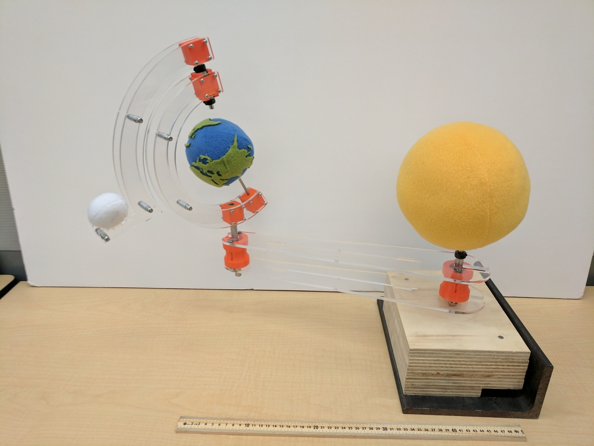

 

## Make your own planets

* Moon dia 5cm
* Sun dia 18cm
* Earth dia 11cm

Made of fleece, with lasercut continents.

## Acrylic and 3D Printed

3D print two spools, and one of each block.  The 608 block needs support (and
maybe raft, depending on your adhesion), but the others should do okay without.

Cut two each of Arm, Small Arc and Moon Arm out of 1/4" acrylic.  Cut one of H Piece.  This takes approx 4 sq ft of material, because it doesn't pack very well.

## Mechanical Parts

In addition to the other parts, you'll need;

* 2x 608ZZ bearings (any skate shop, or Amazon)
* 3-4x [R8ZZ bearings](https://www.amazon.com/gp/product/B00ZSQTJQ2/) ($6 each at mcmaster)
* 1ft 1/2" hollow rod (89495K21)
* 1ft 8mm rod (88625K67)
* ~6in 5mm rod (88625K64)
* 4x 8mm collar (6063K14)
* 1x 5mm collar (57485K65)
* 1x 5mm fender washer (91116A140)
* 20x M3x40 cap screws (91292A024)
* 20x M3 nylock (90576A102)
* 40x M3 washer or fender washer (optional)
* 8x #6x1" sheet metal screws (92470A153, sorry)
* 8x M4 washer (fits #6, optional)
* 5x M5x40 (91292A194)
* 5x M5 nylock (90576A104)
* 5x 24mm of ID=5mm spacer (printed is ok, or use a 20mm from openbuilds with an extra nut)

Tool-wise, you'll need a way to cut and deburr the metal rods, and an arbor
press.  A 1-ton press barely works, I suggest a 2-ton or better.

## Assembly

Cut the 1/2" rod in half, approx 15cm each.  Press an R8 bearing on, then the spool, then
another R8.  Don't get it too tight or it will bind.  Do this for both pieces.

Cut the 8mm rod in two pieces, approx 33cm and 10cm.  Press into the 8mm block (this goes
on the moon arm), and use collars to attach it with 608's to the other.

Press 5mm rod cut to 18cm into 5mm block, and attach collar, washer and earth.

Screw all blocks in a sandwich with spacers.

Sew moon on.

## Mounting base

I just made a 9cm sandwich of plywood, nailed together for registration, and drilled
a 1/2" hole all the way through.  This has countersunk holes in the metal on the
bottom, but any sort of weighted base with a 1/2" hole should work.
