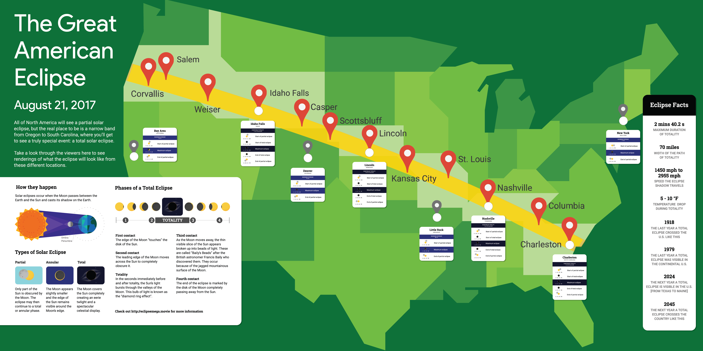
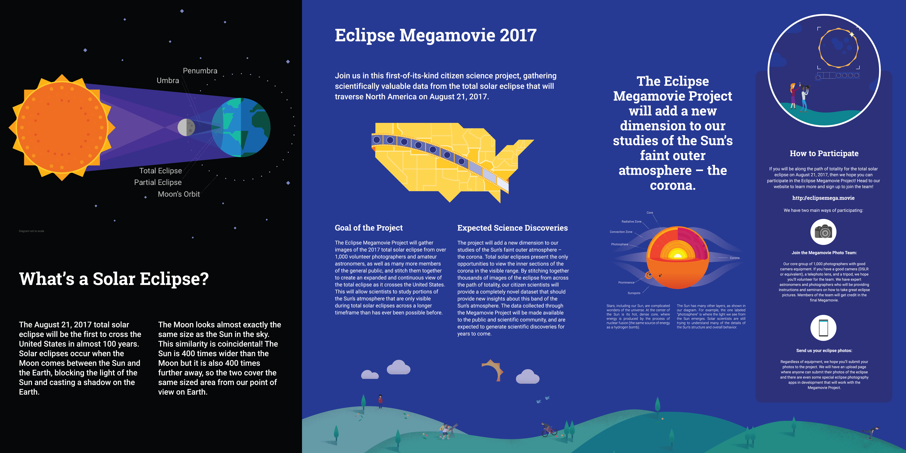

The wall is designed to be printed in 3 pieces 4 ft x 7 ft each; the last page
is the un-split version.  Getting the cropping right at the print shop was a
little tricky.

Each city that gets a phone should have a hole approx 1-3/4" cut; this is fairly
close to the phone holder mounting screws and should be done very carefully.

